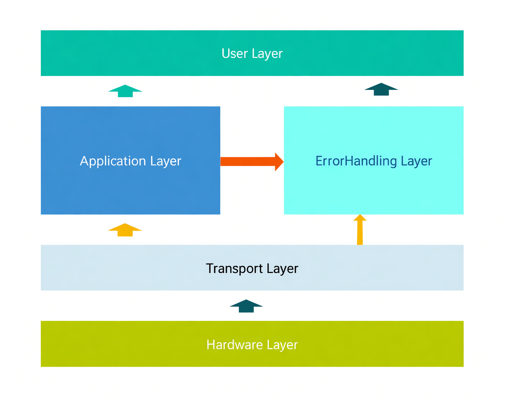

# C-Code-for-GB-T27930---2015-Protocol / GB-T 27930-2015协议C代码实现

A C library for implementing GB/T 27930-2015, the Chinese national protocol for electric vehicle (EV) and charging station communication. Designed for embedded systems.
这是一个用于实现GB/T 27930-2015中国电动汽车与充电站通信国家协议的C语言库。专为嵌入式系统设计。

This project was developed by me during my tenure as head of BMS development for the university Formula Racing team. It has been tested on the STM32F103 platform, and I welcome any corrections or suggestions for improvement.
**Currently, only BMS-side code exists; charger-side code awaits update**.

## Structure / 项目结构

The project is organized into the following layers:
该项目组织为以下层次：

- **Application Layer**: Handles the high-level protocol implementation for GB/T 27930-2015
  **应用层**：处理GB/T 27930-2015的高级协议实现
- **Transport Layer**: Manages data transport and communication protocols
  **传输层**：管理数据传输和通信协议
- **Hardware Layer**: Provides abstraction for hardware-specific implementations
  **硬件层**：提供硬件特定实现的抽象
- **User Layer**: Contains charging control logic and user interface
  **用户层**：包含充电控制逻辑和用户界面
- **ErrorHandling Layer**: Manages protocol errors and exceptions
  **错误处理层**：管理协议错误和异常

## How to Use / 使用方法

Just change the Hardware Layer file and replace it with the MCU driver you are using.
只需更改硬件层文件，并将其替换为您正在使用的MCU驱动程序。

## Acknowledgments / 致谢

This project's transport layer implementation is based on the Open-SAE-J1939 repository. I extend my sincere gratitude to all contributors of the [Open-SAE-J1939](https://github.com/DanielMartensson/Open-SAE-J1939) repository for their valuable work.
本项目的传输层实现参考了Open-SAE-J1939仓库的设计思想，向[Open-SAE-J1939](https://github.com/DanielMartensson/Open-SAE-J1939)仓库的所有贡献者表示诚挚的感谢。

## License / 许可证

This project is licensed under the MIT License - see the [LICENSE](LICENSE) file for details.
本项目采用MIT许可证授权 - 详情请参阅[LICENSE](LICENSE)文件。

